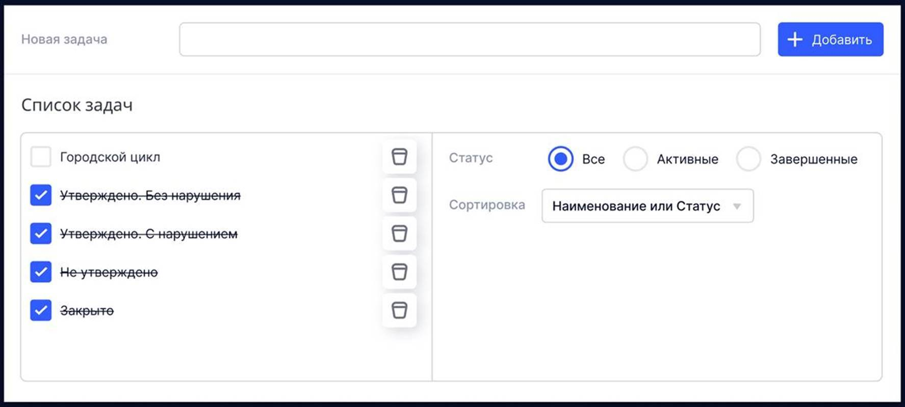
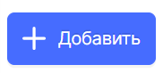
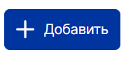

# Тестовое задание на позицию "Frontend React разработчик" от "Datagile"

Выполнил: Максимов Евгений Алексеевич.

Написать приложение-форму для создания списка задач TODO, где стили контролов и разметка должны примерно соответствовать макету.
Можно использовать дефолтные стили радиокнопок и чекбоксов.
Форма состоит из следующих элементов:

1. область добавления задачи (поле ввода и кнопка Добавить)
2. область списка задач с чекбоксами для завершения и пиктограммами удаления задачи
3. поле фильтра по статусу задачи, состоящее из группы радиокнопок: Все/Активные/Завершенные. По-умолчанию – Все.
4. поле вида сортировки задач, состоящее из выпадающего списка с двумя опциями: Наименование и Статус. По-умолчанию – Наименование.

Дополнительные условия:
1. Управление состоянием списка реализовать с помощью react-redux или redux toolkit (RTK)
2. Настроить изменение стилей кнопки, добавить:
    - при наведении мыши (hover) её цвет должен быть светлее.
    - при клике на кнопку (action) её цвет должен быть темнее.

3. Использовать TypeScript для типизации констант/переменных.
4. Проект разместить на гитхабе, в личном аккаунте

# Описание проекта

# Запуск приложения
`npm start`

Runs the app in the development mode.\
Open [http://localhost:3000](http://localhost:3000) to view it in your browser.

The page will reload when you make changes.\
You may also see any lint errors in the console.

`npm run build`

Builds the app for production to the `build` folder.\
It correctly bundles React in production mode and optimizes the build for the best performance.

The build is minified and the filenames include the hashes.\
Your app is ready to be deployed!
