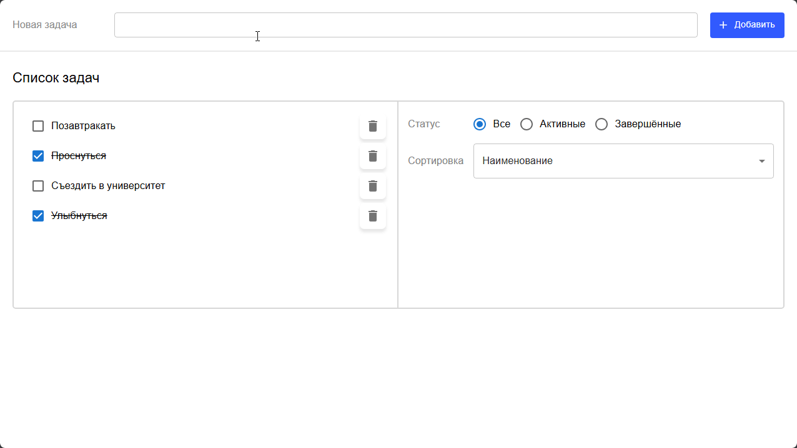

# Тестовое задание на позицию "Frontend React разработчик" от "Datagile"

Выполнил: Максимов Евгений Алексеевич.

Написать приложение-форму для создания списка задач TODO, где стили контролов и разметка должны примерно соответствовать макету.
Можно использовать дефолтные стили радиокнопок и чекбоксов.
Форма состоит из следующих элементов:

1. область добавления задачи (поле ввода и кнопка Добавить)
2. область списка задач с чекбоксами для завершения и пиктограммами удаления задачи
3. поле фильтра по статусу задачи, состоящее из группы радиокнопок: Все/Активные/Завершенные. По-умолчанию – Все.
4. поле вида сортировки задач, состоящее из выпадающего списка с двумя опциями: Наименование и Статус. По-умолчанию – Наименование.

Дополнительные условия:
1. Управление состоянием списка реализовать с помощью react-redux или redux toolkit (RTK)
2. Настроить изменение стилей кнопки, добавить:
    - при наведении мыши (hover) её цвет должен быть светлее.
    - при клике на кнопку (action) её цвет должен быть темнее.

3. Использовать TypeScript для типизации констант/переменных.
4. Проект разместить на гитхабе, в личном аккаунте

# Описание приложения
Приложение реализует форму для создания списка задач в соответствии с предоставленным макетом и техническим заданием.

✅ Область добавления задачи - поле ввода и кнопка "Добавить". Дополнительно: вместо нажатия кнопки "Добавить" можно нажать клавишу "Enter" после ввода названия задачи. 
✅ Область списка задач с чекбоксами для завершения и кнопками для удаления задачи. 
✅ Поле фильтра по статусу задачи, состоящее из группы радиокнопок: Все/Активные/Завершенные. По умолчанию установлено Все. 
✅ Поле вида сортировки задач, состоящее из выпадающего списка с опциями: Наименование/Статус. По умолчанию установлено Наименование. 
✅ Управление состоянием списка реализовано при помощи Redux Toolkit. 
✅ При наведении мыши на кнопку "Добавить" её цвет становится светлее, при клике на кнопку её цвет становится темнее. 
✅ Используется TypeScript для типизации подавляющего большинства переменных и констант. 

### Используемые библиотеки и технологии:
- Node.js;
- TypeScript;
- React;
- Redux Toolkit;
- MUI.

# Запуск приложения
### Требования:
- `npm >= 11.3.0`
- `node >= 22.15.0`

Перед запуском приложения необходимо установить зависимости.

`npm ci`

Чтобы запустить приложение, используйте команду:

`npm start`

Приложение откроется на [http://localhost:3000](http://localhost:3000).
